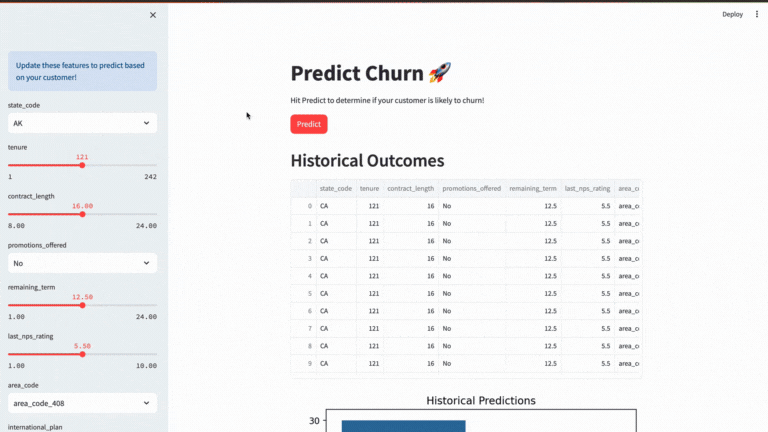

Creating a well-structured README is crucial for effectively communicating your project's purpose, functionality, and usage to potential collaborators and users. Here's a template for a README for your Full Stack Customer Churn Prediction ML Project:

# Customer Churn Prediction Project


 <!-- If you have a project image, add it here -->


## Table of Contents

- [Overview](#overview)
- [Demo](#demo)
- [Features](#features)
- [Getting Started](#getting-started)
  - [Prerequisites](#prerequisites)
  - [Installation](#installation)
- [Usage](#usage)
- [Project Structure](#project-structure)
- [Model Training](#model-training)
- [Deployment](#deployment)
- [Contributing](#contributing)
- [License](#license)
- [Acknowledgments](#acknowledgments)

## Overview

Customer churn prediction is a critical task for businesses to retain customers. This project offers a full-stack solution for predicting customer churn using machine learning classification. It includes data preprocessing, model training, deployment, and an interactive Streamlit UI for making real-time predictions.

## Demo

Provide a link or a screenshot of your deployed Streamlit UI here.

## Features

- User-friendly Streamlit UI for inputting customer data and getting churn predictions.
- Data preprocessing and feature transformation.
- Classification model for predicting customer churn.
- Logging of historical predictions.
- Visualization of historical prediction distribution.
- Optional integration of additional reports or features.

## Getting Started

### Prerequisites

List the prerequisites or dependencies users need to install and run your project. Include links to relevant documentation or resources.

- Python (>=3.6)
- Streamlit
- Pandas
- Scikit-learn
- XGBoost (or other machine learning libraries used)

### Installation

Provide step-by-step instructions for users to install your project.

```bash
git clone https://github.com/yourusername/customer-churn-prediction.git
cd customer-churn-prediction
pip install -r requirements.txt
```

## Usage

Explain how to use your project:

1. Run the Streamlit app:
   ```bash
   streamlit run app.py
   ```

2. Open the provided URL in your web browser.

3. Adjust input features in the sidebar to predict customer churn.

4. Click the "Predict" button to see the prediction outcome.

## Project Structure

Explain the structure of your project's directories and files:

- `app.py`: The Streamlit UI application.
- `utils.py`: Utility functions for data transformation and preprocessing.
- `models/`: Directory containing saved ML models.
- `data/`: Directory containing dataset and schema files.
- `scripts/`: Scripts for training and updating the ML model.
- `README.md`: This readme file.
- `requirements.txt`: List of project dependencies.

## Model Training

If applicable, provide information on how to retrain or update the machine learning model using the provided scripts.

## Deployment

Explain how to deploy your Streamlit app or provide a link to the deployed version if available.

## Contributing

Explain how others can contribute to your project. Include guidelines for reporting issues or submitting pull requests.

## License

This project is licensed under the [MIT License](LICENSE).

## Acknowledgments

Acknowledge and give credit to any libraries, tools, or resources you used or were inspired by during your project's development.

---

Feel free to adapt this template to fit your project's specific details and requirements. A well-documented README can make your project more accessible and encourage collaboration from the open-source community.